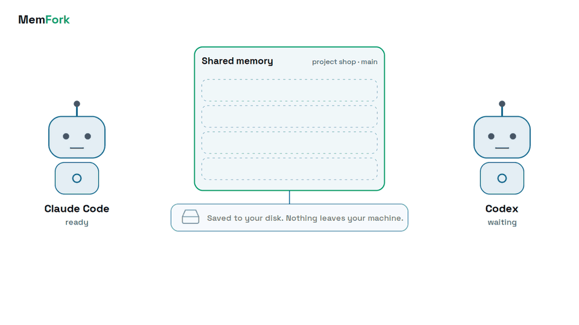
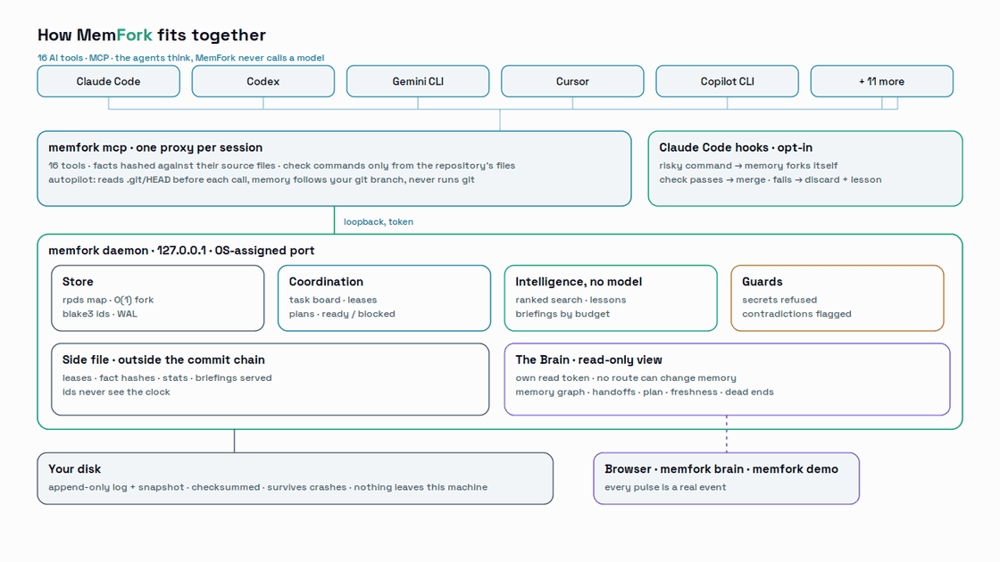

<div align="center">

<picture>
  <source media="(prefers-color-scheme: dark)" srcset="docs/assets/memfork-logo-dark.svg">
  
</picture>

# MemFork

**Git for agent memory, shared by every AI tool on your machine.**

[](https://github.com/memforkdb/memfork/actions/workflows/ci.yml)
[](LICENSE)
[](https://crates.io/crates/memfork)
[](https://docs.rs/memfork-core)
[](https://pypi.org/project/memfork/)

</div>

Agents work by trying things, and they rarely work alone. MemFork is memory built for both.

Your agent can fork everything it remembers before a risky step, merge the fork if the attempt worked, discard it if it did not, and rewind to how things were at any earlier point. Forking costs the same whether memory holds ten things or ten million, so an agent can branch freely instead of being careful.

That memory is shared. Claude Code, Codex, Cursor, Gemini and any other MCP client read and write the same store, so one agent can stop mid-task and leave a handoff, and another can resume from it: what was decided, why, what is done, and what comes next. No pasting context between tools. No starting over when you switch models.

It runs in your own process or as a small local server, keeps what it stores, and is Apache-2.0. MemFork itself sends nothing anywhere: no cloud, no account, no telemetry. What an agent reads from it becomes part of that agent's prompt and goes wherever that agent already sends your code; with a local model the whole loop stays on your machine.

You don't need five AI tools to benefit. With just one, your agent remembers across sessions and can undo its mistakes. With more, they share the work.

<picture>
  <source media="(prefers-color-scheme: dark)" srcset="docs/assets/memfork-story-dark.gif">
  <source media="(prefers-color-scheme: light)" srcset="docs/assets/memfork-story-light.gif">
  
</picture>

## Install

**macOS and Linux**

```sh
curl -fsSL https://github.com/memforkdb/memfork/releases/latest/download/install.sh | sh
```

**Windows**

```powershell
irm https://github.com/memforkdb/memfork/releases/latest/download/install.ps1 | iex
```

**With Python or Rust**

```sh
pip install memfork      # or: uv tool install memfork
cargo install memfork    # builds from source; needs Rust 1.89 or newer and a C linker
```

If `memfork` is not found afterwards, open a new terminal. On macOS and Linux
the installer prints the exact line to add to your shell's startup file if its
directory is not on your `PATH` yet; `pip` warns in the same way when its
scripts directory is not on it, and `uv tool install` or `pipx install` avoid
the question.

The install scripts put one file into a directory you own — `~/.memfork/bin` or
`%LOCALAPPDATA%\Programs\memfork\bin` — and nothing asks for administrator.
They check the download against a published checksum, tell you how to
uninstall, and if you are upgrading they stop the old version first. `pip` and
`cargo` put the same `memfork` command wherever they put commands; run
`memfork stop` before upgrading through either. Installing from a mirror, or
with no internet at all, is in [docs/ADOPTING.md](docs/ADOPTING.md).

`memfork completions bash|zsh|fish|powershell|elvish` prints a completion
script for your shell, to source or install where your shell looks.

## Uninstall

```sh
memfork stop                          # end the background server
memfork init --project --remove       # in each repository you ran init --project in
rm -rf ~/.memfork/bin                 # the binary the install script put there
```

On Windows, `Remove-Item -Recurse -Force "$env:LOCALAPPDATA\Programs\memfork\bin"`
and take that directory out of your user `PATH`; the installer prints the
exact line. If you installed with `pip` or `cargo`, uninstall with the same
tool. Each MCP client keeps its own registration: `claude mcp remove memfork`,
`codex mcp remove memfork`, and so on, or delete the `memfork` entry from the
file `memfork doctor --verbose` names for that client. Your stored memory is
the data directory `memfork doctor` prints; delete it if you want that gone
too.

## Connect it to your tools

```sh
memfork init
```

That finds the MCP clients you have and registers MemFork with each one,
preferring the client's own command so it writes its own configuration. Restart
the client and the tools appear.

```text
$ memfork init
  Claude Code    ran                claude mcp add --scope user memfork -- /home/ada/.memfork/bin/memfork mcp
  Cursor         added              /home/ada/.cursor/mcp.json
  Codex CLI      ran                codex mcp add memfork -- /home/ada/.memfork/bin/memfork mcp

Registered with 3 client(s). Restart them to pick up the tools.
```

If something is not working, `memfork doctor` says which MemFork is running,
where your memory is kept, and what each client thinks is registered. The
first command or tool call starts a small background server, which can take a
few seconds on a first run while the system checks a new program; if it does
not start within a minute, the error names what was tried and the log file
holding its own output (`memfork-daemon.log` in the data directory), and
`MEMFORK_START_TIMEOUT=180` allows a slow machine longer.

## Try it

Ask your agent to remember something, branch, change it on the branch, and
throw the branch away. From the command line, the same thing — in a scratch
database in memory, so it touches nothing you have stored:

**macOS and Linux** (bash or zsh; in fish, save the lines to a file and run `memfork run file`)

```sh
memfork run - <<'SCRIPT'
put plan:1 "ship on Friday"          # remember something

fork attempt                          # branch the whole of memory
put plan:1 "ship on Monday" --branch attempt
get plan:1                            # still "ship on Friday" here

discard attempt                       # the attempt never happened
get plan:1                            # "ship on Friday"
SCRIPT
```

**Windows (PowerShell)**

```powershell
@'
put plan:1 "ship on Friday"          # remember something

fork attempt                          # branch the whole of memory
put plan:1 "ship on Monday" --branch attempt
get plan:1                            # still "ship on Friday" here

discard attempt                       # the attempt never happened
get plan:1                            # "ship on Friday"
'@ | memfork run -
```

Swap `discard` for `merge attempt` and the change comes back to the main line
instead. Nothing is copied either way: a branch shares structure with the
branch it came from until one of them changes.

Or watch the whole thing move: `memfork demo` starts a store of its own in a
temporary directory, opens [the Brain](#the-brain) on it, and plays a scripted
session with two stand-in clients: a fact and a decision, a plan worked, a
fork discarded with a lesson, a handoff picked up by the other client, a fact
going stale, a decision disputed across branches. Nothing is spent, no AI tool
is needed, your own memory is not touched, and the store is removed when you
press Ctrl+C.

## What your agent gets

Sixteen tools, in four groups.

<picture><source media="(prefers-color-scheme: dark)" srcset="docs/assets/icons/package-dark.svg"></picture>
**Remember and recall** — store a value under a key, read it back, list keys by
prefix, delete, find entries by their words, and search by meaning when you
supply a vector. A finding stored with the files it came from says, when it is
read, whether those files have changed since.

<picture><source media="(prefers-color-scheme: dark)" srcset="docs/assets/icons/git-branch-dark.svg"></picture>
**Branch** — fork memory, compare two branches, merge one into another, discard
one entirely, or switch which branch you are working on.

<picture><source media="(prefers-color-scheme: dark)" srcset="docs/assets/icons/rotate-ccw-dark.svg"></picture>
**Go back** — read memory as it was at any earlier point, or look through the
history of what changed.

<picture><source media="(prefers-color-scheme: dark)" srcset="docs/assets/icons/arrow-right-left-dark.svg"></picture>
**Hand over** — pick up a project where the last agent left it, in as many
bytes as you allow, and leave a note for the next one when you stop. Claim a
task so no other agent starts it, and keep the lesson when an attempt is
thrown away.

Full descriptions are in [the tool reference](#mcp-tools) below.

## Supported clients

`memfork init` knows each of these and uses the client's own command where it
has one. No client is special.

| Client | How MemFork registers |
|---|---|
| Claude Code | `claude mcp add` |
| Cursor | its `mcp.json` |
| Codex CLI | `codex mcp add` |
| Gemini CLI | `gemini mcp add` |
| Grok Build | `grok mcp add` |
| Cline | `cline mcp add`, or the extension's settings file |
| OpenCode | `opencode mcp add`, or `opencode.json` |
| Qwen Code | `qwen mcp add` |
| Kiro | its `mcp.json` |
| GitHub Copilot CLI | `copilot mcp add`, or `mcp-config.json` |
| Devin CLI | `devin mcp add`, or `mcp_config.json` |
| Windsurf | its `mcp_config.json` |
| Zed | `settings.json` (`context_servers`) |
| Visual Studio Code | `mcp.json` (`servers`) |
| Factory Droid | its `mcp.json` |
| OpenHands | `openhands mcp add`, or `mcp.json` |

Every entry is data in one registry file, checked against the client's own
documentation on a recorded date. Where something could not be confirmed — a
closed-source client's name in MCP `initialize`, a path the documentation
gives for only one OS — the entry says so, and `memfork doctor --verbose`
shows it, rather than guessing. A file MemFork edits keeps every other byte:
comments, key order, whitespace and trailing commas included.

Anything else that speaks MCP over stdio works too — point it at `memfork mcp`.

## Several clients, one memory

<picture><source media="(prefers-color-scheme: dark)" srcset="docs/assets/icons/plug-dark.svg"></picture>
Point as many clients at MemFork as you like. The first one that actually uses
memory quietly starts a small server that owns the store; the rest connect to
it. You never have to start it yourself, and nothing starts until a tool is
called — a client that only checks that MemFork works leaves nothing running.

```sh
memfork doctor   # is it running, on what port, which version
memfork stop     # shut it down now rather than waiting for it to go idle
```

It listens on `127.0.0.1` only and needs a token it writes to a file only you
can read, so nothing off your machine can reach your memory. It exits by itself
once nothing has needed it for ten minutes.

Clients share the data but not their place in it: each keeps its own current
branch, so one client forking or switching never moves another.

**See what is happening.** Leave this running in a terminal while your agents
work:

```text
$ memfork watch
* daemon connected 127.0.0.1:52817, version X.Y.Z, store /home/ada/.local/share/memfork
  clients connected: Claude Code (shop)
14:02:11  Claude Code     put        shop:decision:payments  on main
14:02:40  Claude Code     fork       on try-refunds
14:05:02  Claude Code     discard    on try-refunds
14:05:09  Claude Code     handoff    shop:handoff:00000003  on main
14:06:30  * Codex CLI connected  project shop
14:06:31  Codex CLI       resume     on main
```

`--json` prints one JSON object per line instead. It waits for the server if
none is running rather than starting one, and a `watch` left open does not keep
an otherwise idle server alive.

And to see the history behind it:

```text
$ memfork log --graph
* 7c0e2f4b9a1d  seq 6  [main]  merge    merge try-refunds into main (fail)
|-\
|-+-x discarded try-a-rewrite (2 commits)
* | 3fa1d0c6b2e7  seq 5                 put shop:decision:tax  by Codex CLI
| * 91b7e3a0c4d2  seq 5  [try-refunds]  put shop:task:refunds  by Claude Code
|-/
* 5d2c19e7f0a3  seq 4  fork point       put shop:decision:payments  by Claude Code
```

**Upgrading:** the installer stops it for you. If you are replacing the binary
by hand, run `memfork stop` first — a server from a different version will not
talk to a client from this one, and says so rather than guessing.

## Handing work between agents

One agent can stop in the middle of a task and another, from any vendor,
can pick it up: what was decided and why, what is done, and what comes next.

**Each project has a namespace.** When a client starts `memfork mcp`, MemFork
takes the name of the repository it was started in (or of the working
directory, outside a repository), lowercased, and tells the agent that name
when it connects. Everything about the project goes under it, with colons
between the parts:

| Key | What it holds |
|---|---|
| `shop:decision:<topic>` | a decision and the reason for it |
| `shop:task:<id>` | an open task; `{"status":"done"}` closes it |
| `shop:handoff:<n>` | handoff notes, numbered, the newest last |
| `shop:lesson:<n>` | what a discarded attempt taught, numbered |

Set it yourself with `memfork mcp --namespace <name>` in the client's
configuration, or with `MEMFORK_NAMESPACE`. The tools that take a key take it
literally: nothing is prefixed for you, and keys written before namespaces
existed are exactly where they were.

**Two tools do the handing over.** `memfork_resume` returns one short briefing:
the latest handoff, the most recent decisions and the open tasks. An agent
calls it when it starts. `memfork_handoff` records where things stand, and an
agent calls it before it stops or before you switch to another tool.

The same routine works with a single tool. Call `memfork_handoff` before you
stop, and `memfork_resume` when a new session of the same tool starts, including
after a context reset or a usage limit. The new session picks up the decisions
and next steps instead of starting over.

A worked example, in a repository called `shop`:

```text
In Claude Code:
  you    Add hosted checkout. We're not storing card data, so use the
         provider's hosted page.
  agent  memfork_put shop:decision:payments "Hosted checkout: no card data
         on our servers."  ...builds it...
  you    I'm out of time; hand this over.
  agent  memfork_handoff  summary "Checkout works; refunds not started"
                          next ["refunds", "EU tax"]
                          blockers ["need a sandbox account for refunds"]

Later, in Codex:
  you    Carry on with the shop.
  agent  memfork_resume
         -> latest handoff by claude-code: "Checkout works; refunds not
            started", next: refunds, EU tax; decision: hosted checkout,
            no card data on our servers
  agent  Starting on refunds. You'll need a sandbox account first...
```

**Who wrote what is kept.** Everything a client stores records the name the
client gave when it connected, so a briefing says which agent decided or handed
off what.

**Tell every agent the routine.** Run this inside the repository:

```sh
memfork init --project            # the clients installed here
memfork init --project --all      # every client, for a repository your team shares
memfork init --project --client codex --client gemini-cli
```

It writes one short block — resume when you start, record decisions with their
reasons, hand off before you stop, fork before anything risky — into the
instruction file each client reads (`AGENTS.md`, `CLAUDE.md`, `GEMINI.md`),
once per file however many clients share it. The block sits between two marker
comments and nothing outside them is touched: running it again updates only
the block, `--remove` takes only the block out, `--dry-run` prints the exact
diff and writes nothing. It never runs git; committing the files is up to you.
Plain `memfork init` never edits files in your project.

**What is not shared.** Agents share what they write down, not their
conversation. A handoff carries only what the agent put into it, and a decision
that was discussed but never stored is not there for the next one. The block
above exists to make writing it down the habit.

## Agents working together

When two agents work on one project at the same time, or one after another,
four things keep them out of each other's way.

**Claim a task before starting it.** `memfork_task` keeps the project's task
board: `add` a task, `claim` it, `done` when it is finished, `release` to give
it back, `list` to see the board. Of two agents claiming the same task, one
gets it and the other is told who has it, including when both are windows of
the same tool. A claim lasts five minutes unless the agent asks for up to an
hour, and `memfork mcp` keeps renewing it for as long as the agent's session
is open, so a long build does not lose it. When a session ends, or crashes, its
claims run out within one lease and the task is free again. Claims are kept by
the running MemFork server, not in memory's history: after a restart every task
is free.

```text
  agent A  memfork_task claim id 3   -> claimed shop:task:3
  agent B  memfork_task claim id 3   -> held by claude-code (280s left)
```

**Keep the lesson when you throw an attempt away.** `memfork_discard` with a
`lesson` — one line, at most 300 characters — keeps what the attempt taught on
the branch it was forked from, as `shop:lesson:<n>`, and throws everything else
away. The next agent's briefing includes it.

```text
  agent  memfork_fork try-sqlite ... it deadlocks ...
  agent  memfork_discard try-sqlite  lesson "sqlite locks under our concurrent writers"
  later, another agent: memfork_resume -> lessons: "sqlite locks under our ..."
```

**Store findings with their sources.** `memfork_put` with `sources`, a list of
paths in the repository, makes the entry a fact. MemFork records what those
files held, and every later read says `fact: fresh` if they are unchanged or
`fact: stale` with the files that changed. Put the fact again after checking
it, and it is fresh. The hashing happens in `memfork mcp` on your machine, where
the files are. Of a file over 8 MiB only the first 8 MiB and its length are
hashed, and a read stops hashing after 64 MiB, saying `unverified` for the rest. Only the paths are stored in memory's
history, so the same finding has the same id on every machine.

**Ask for a briefing that fits.** `memfork_resume` takes `task`, what the agent
is about to do, and puts what matches it first; and `budget`, the most bytes
the briefing may take (1024 to 65536, 6 KB by default). It never goes over,
leaving out the least useful things first and counting what it left out. Each
briefing says how big it is:

```json
"budget": { "limit_bytes": 2048, "bytes": 1873, "approx_tokens": 469,
            "estimate": "approx_tokens = bytes / 4, rounded up" }
```

Bytes are exact. Tokens are an estimate: tokenisers differ between models, and
MemFork never calls one.

**See what changed while you were away.** Every briefing starts with
`since_last`: what other agents decided, which tasks they claimed or finished,
the handoffs they left, and which facts have gone stale since this tool last
looked at this project. Coming back to a project you know, `memfork_resume`
with `since_last_only` returns just that, which is far smaller. A tool MemFork
has not seen here before gets the whole briefing.

**See what it is doing.** `memfork stats` shows, per project and tool,
briefings given and their bytes, the bytes of memory they summarised, lessons
kept and served, facts found fresh or stale, and claims won and lost. The counts
are kept in `memfork-sidecar.json` in the data directory, outside memory's history.
`memfork watch` shows claims, lessons and fact checks as they happen.

## Plans that agents work in order

A plan is tasks with dependencies, kept on the board, so whichever agents are
connected — several tools, or several windows of one — pull the next ready task
instead of being told what to do. Start from a template, fill in the
acceptance commands, and put it on the board:

```sh
memfork plan templates                 # feature, bugfix, refactor, upgrade, tests
memfork plan new --template bugfix     # writes memfork-plan.toml
memfork plan check                     # shape, ids, no cycles
memfork plan write                     # onto the board
memfork plan show                      # ready, claimed, blocked and by what, done
```

A plan file is plain TOML:

```toml
[[task]]
id = "test"
title = "Write a test that fails because of the bug"

[[task]]
id = "fix"
title = "Fix the cause, so the new test passes"
depends_on = ["test"]
accept = "cargo test"      # exits 0 when the task is done
```

An agent asks `memfork_task` for tasks with `status` ready, claims one, does it
and marks it done. If the task has an acceptance command, marking it done runs
it in the project, on your machine, with a time limit: passing closes the task,
failing reopens it with a lesson saying what failed. **A command runs only if
the repository's plan file holds the same command for that task**, so nothing
an agent writes into shared memory can make another agent's tool run a
command. An empty `accept = ""` is never run. Commands run under `sh` on macOS
and Linux and `cmd` on Windows, so a plan shared across systems uses commands
that mean the same in both.

## Memory that looks after itself

**Duplicates and contradictions are flagged, never fixed.** Two tools deciding
the same thing differently on different branches, the same value stored under
near-identical keys, or two facts from the same files that disagree: the write
that caused it says so, briefings list them, `memfork flags` shows them all
and `memfork doctor` counts them. Which one is right is for an agent or you to
decide.

**When memory needs tidying, MemFork asks for it as a task.** When a project's
memory grows past 256 KiB, more than twenty handoffs are superseded, more than
ten facts have gone stale, or more than five things are flagged, MemFork adds
one maintenance task saying exactly what to tidy. An agent claims it, does the
work on a fork, and marks it done naming the fork. MemFork checks the result by
fixed rules — nothing pinned or recent removed, everything removed accounted
for, the project smaller — and merges it, or discards it with a lesson saying
which rule it broke. MemFork never calls a model to do this; the agents you
already use do the thinking. `memfork maintain off` switches it off for a
project.

**Credentials are refused.** A write that holds something shaped like a
private key, a well-known token or a password is not stored, and the refusal
says which rule matched and where, without repeating it. Memory is shared with
every tool and shown to people, so a key pasted into it has leaked. If it is
not a secret, write it again naming the rule: `allow_secret`, or
`--allow-secret` on the command line.

**Prompts.** MemFork offers its routines as MCP prompts — resume, handoff,
review-decisions, tidy-memory, next-task — which Claude Code, Gemini CLI, VS
Code and Cline show as slash commands.

## The Brain

`memfork brain` opens a page in your browser that shows what the engine knows
and what it did with it: the memory graph, the handoffs, the plan, which facts
are fresh, the dead ends, the briefings it served, and what needs a look. It is
served by the local daemon, on `127.0.0.1` only, and it is a view of a
database engine, not a control panel.

**Nothing on the page changes memory.** There is no button that forks, merges,
discards, releases or stops anything; every write stays with your agents and
the command line. The one control is time travel: drag the timeline and the
graph shows memory as it was at that point, read only.

What is on it:

- **The headline**: *N things your agents did not have to learn twice*, where
  N is dead ends not repeated, stale facts caught, claim conflicts avoided and
  handoffs picked up, counted from what actually happened.
- **The graph.** Every node is a real entry or a connected client: agents,
  briefings, decisions and handoffs, lessons, the plan, facts and source files,
  in columns left to right. Every edge is a relation the engine already knows —
  a fact's source files, a decision citing a fact, a lesson about a decision, a
  task's dependencies, a handoff's next tasks, a briefing and what it carried —
  and nothing is inferred by a model. The same store draws the same picture on
  every machine, and adding a node never moves another. Hover for the value,
  click for the side sheet: the value, sources with fresh or stale per file,
  the entry's history across commits, and what it is connected to.
- **Motion is evidence.** A pulse travels from an agent to what it wrote, from
  an agent to the task it claimed, from a changed file back to the fact and on
  to what cited it, and from what a briefing gathered to the agent it was
  served to. Nothing moves when nothing happened, and nothing moves at all
  when your system asks for reduced motion.
- **Lenses** show the same graph through handoffs, coordination, freshness,
  dead ends or briefings. **Search** at the top runs the engine's own ranked
  text search and lights up the hits.
- **Panels**, all read only: handoffs and who picked each up, the board with
  who holds what and what is blocked, facts and what changed, lessons and how
  often each was served since, briefings served with bytes and approximate
  tokens, and what needs attention.
- **Compare branches** lists the keys two branches disagree on, the same view a
  merge would face. **Export this view** makes one self-contained file, after a
  preview, with anything shaped like a credential withheld; your browser saves
  it and nothing is uploaded anywhere.

The address it prints carries the daemon's read token after the `#`, which a
browser never sends to a server. That token can only read: the daemon refuses
it on every route that writes. It dies with the daemon: after `memfork stop`
the page says the server stopped and asks you to run `memfork brain` again,
and it never scans or retries other ports. `memfork brain --no-open` prints
the address without opening a browser; `memfork doctor` shows the address
without the token; `MEMFORK_BROWSER` names another program to open it with,
or `none`. The page is black; add `?light` to the address for a light theme.
The whole page works from the keyboard: the graph takes arrow keys, Enter and
Escape, and `/` goes to search. On a phone-width window the panels stack and
the graph shows the current lens.

What to look for, with your own tools working in one project: a handoff left
by one and picked up by another as a pulse into a briefing; a fact going amber
when its file changes; a lesson appearing when a fork is discarded; the
timeline dragged back across all of it; the window narrowed to phone width;
then `memfork stop`, and the page reporting that the server stopped. The same
with one tool alone.

An administrator can switch the Brain and the demo off for a machine with
`brain = false` in the [machine policy](#for-administrators).

## Why not Redis, or a vector database?

| | MemFork | Redis | Vector DBs |
|---|---|---|---|
| Fork state before a risky step | O(1), any size | — | — |
| Merge two lines of work | three-way, key level | — | — |
| Throw an attempt away completely | one call | — | — |
| Read the state as of ten steps ago | one call | — | — |
| Multi-key transaction with real rollback | yes | `MULTI`, no rollback on error | — |
| Runs in your process | yes | network hop | network hop |
| Licence | Apache-2.0 | RSAL / SSPL | varies |

The thing MemFork is for is the shape of agent work: try something, then either
keep it or pretend it never happened. That is a branch, and branching state is
what MemFork does that a key-value store does not.

## For administrators

One file switches features off for every user of a machine and can pin where
memory is kept. Nothing a user sets — a flag, an environment variable, a
project's own `.memfork` directory — overrides it. `memfork doctor` shows the
policy in force and where the file goes on this machine:

| OS | Policy file |
|---|---|
| Windows | `%ProgramData%\memfork\policy.toml` |
| macOS | `/Library/Application Support/memfork/policy.toml` |
| Linux | `/etc/memfork/policy.toml` |

Every key is optional:

```toml
brain = false              # memfork brain and memfork demo, the read-only page
race = false               # memfork race
autopilot = false          # memory following the git branch, automatic forks
maintenance_tasks = false  # tasks MemFork adds to tidy a project's memory
sampling = false           # asking a client's model for a summary
secret_overrides = false   # allow_secret / --allow-secret
data_dir = "/srv/memfork"  # where memory is kept, for everyone
```

A file that cannot be read stops every command except `memfork doctor`, which
says what is wrong with it: a typo in a machine-wide rule should be found, not
quietly ignored. `MEMFORK_POLICY_FILE` names a second file for trying a policy
out; where both set a key the machine file wins, so it can only add
restrictions. The rest of what an organisation needs to know — what listens
where, what is stored, how to audit it, how to install without reaching the
internet — is in [docs/ADOPTING.md](docs/ADOPTING.md) and
[SECURITY.md](SECURITY.md).

## What it does not do

<picture><source media="(prefers-color-scheme: dark)" srcset="docs/assets/icons/shield-check-dark.svg"></picture>
Said plainly, because finding out later is worse.

- **Search is exact, not approximate.** Every entry with a vector is compared,
  so a million of them is a million comparisons. Fine for tens of thousands;
  slow beyond that. An index that understands branches is still to come. Text
  search reads every entry under the prefix too: about 25 ms for 10,000
  entries and 250 ms for 100,000 on a laptop.
- **Words, not meaning, without a vector.** Text search matches words, not
  synonyms. MemFork never calls a model.
- **No embedding model.** You supply the vectors; MemFork stores and compares
  them.
- **One machine.** Not distributed, not replicated. The server is local only.
- **Your memory is a file you own.** It is not encrypted, and anything running
  as you can read it. Do not put secrets in it.
- **The Python library is separate from the shared store.** `import memfork`
  gives you an engine in your own process; it does not see what an MCP client
  wrote. Connecting the two is on the list.

## MCP tools

| Tool | What it does |
|---|---|
| `memfork_put` | Store a value under a key, with an optional vector, importance, and source files that make it a fact |
| `memfork_get` | Read a key back |
| `memfork_list` | List keys under a prefix |
| `memfork_delete` | Forget a key |
| `memfork_search` | Find entries by their words, or the entries nearest a vector |
| `memfork_fork` | Branch the whole of memory |
| `memfork_merge` | Merge one branch into another |
| `memfork_discard` | Throw a branch away, keeping a one-line lesson if you give one |
| `memfork_diff` | What differs between two branches |
| `memfork_branches` | List branches |
| `memfork_checkout` | Switch this client's current branch |
| `memfork_at` | Read a key as it was at an earlier point |
| `memfork_log` | The history of a branch |
| `memfork_resume` | A briefing on a project within a byte budget: latest handoff, lessons, decisions, facts, open tasks |
| `memfork_task` | The task board and plans: add, plan, claim, renew, release, finish and list tasks |
| `memfork_handoff` | Leave a note on where the work stands, for whoever picks it up |

---

# For developers

## Examples

Small runnable programs, one per idea — a single agent's memory loop, a
handoff between two sessions, a plan worked by two scripted clients, reading
the event stream — are in [examples/](examples/README.md):

```sh
cargo run -p memfork --example memory_loop
```

## Rust

```toml
[dependencies]
memfork-core = "0.2"
```

```rust
use memfork_core::{Db, Value};

let db = Db::new();
db.put("main", "plan:1", Value::new("ship on Friday"))?;

db.fork("main", "attempt")?;
db.put("attempt", "plan:1", Value::new("ship on Monday"))?;

// The parent is untouched until you merge.
assert_eq!(db.get("main", "plan:1")?.unwrap().value, "ship on Friday");

db.discard("attempt")?;
# Ok::<(), memfork_core::Error>(())
```

`memfork-core` is the engine on its own: no I/O, no async, no network. It is
what the binary and the Python package are both built on.

## Python

```sh
pip install memfork
```

```python
import memfork

db = memfork.Database()
db.put("plan:1", b"ship on Friday")

db.fork("attempt")
db.put("plan:1", b"ship on Monday", branch="attempt")
db.get("plan:1").value        # b'ship on Friday' — the fork is invisible here

db.merge("attempt")           # or db.discard("attempt")
```

One wheel carries both this and the `memfork` command, for Python 3.9 and
newer, on Linux (glibc and musl), macOS and Windows, x86-64 and arm64 — so
installing never needs a compiler.

`memfork.Database` is in memory only: it does not write to disk and does not
see what an MCP client wrote. The durable store shared between clients belongs
to the server.

## Command line

| Command | |
|---|---|
| `put`, `get`, `ls`, `del`, `search` | one operation on the shared store; on a terminal `ls` fits values to the width, `--full` shows them whole |
| `fork`, `merge`, `discard`, `diff`, `branches`, `at`, `log` | branching and history on the shared store |
| `log --graph` | every branch as a tree: forks, merges, discarded attempts |
| `watch` | what every client is doing, as it happens; `--json` is a versioned stream other tools can read ([docs/EVENTS.md](docs/EVENTS.md)) |
| `task add\|claim\|renew\|release\|done\|list` | the task board, from the command line |
| `find <text>` | text search over the shared store |
| `facts [prefix]` | every fact, fresh or stale |
| `lessons` | what discarded attempts taught, newest first |
| `plan write\|check\|show\|new\|templates` | plans: tasks with dependencies and acceptance commands |
| `flags` | duplicates and contradictions worth a look |
| `maintain on\|off\|status` | whether MemFork adds maintenance tasks to this project |
| `stats` | briefings, bytes, lessons, facts, claims and handoffs picked up, per project and tool |
| `brain` | open the Brain: the memory graph and what the engine did, read only, on this machine only; `--no-open` prints the address |
| `demo` | play a scripted session on a throwaway store with the Brain open on it; `--fast`, `--exit`, `--agents A,B` |
| `put --source <path>`, `discard --lesson <text>` | store a fact; keep a lesson |
| `run <file\|->` | a script of the above against one in-memory database |
| `mcp` | serve MCP over stdio — what clients run |
| `serve` | run the shared server (started for you when needed) |
| `stop` | shut it down |
| `init`, `doctor` | register with clients; report what is going on (`doctor --verbose` for the whole report) |
| `init --project` | write MemFork's instruction block into this repository's client instruction files |
| `tools --format openai\|anthropic\|gemini` | the tool schemas in a vendor's format |

The operations work on the same store your MCP clients use, through the local
server, which they start if it is not running; `--ephemeral` runs one of them
against a fresh in-memory database instead, keeping nothing and sharing
nothing. `--json` on any command prints machine-readable output. `memfork mcp
--namespace <name>` (or `MEMFORK_NAMESPACE`) names the project a session works
in.

Output is coloured on a terminal that wants it. `--color always` colours it even
when piped, in CI or with `NO_COLOR` set; `--color never` never does; `--json`
and `memfork mcp` never carry colour whatever you ask. Every state also has a
word, so nothing depends on seeing colour.

## How it works

<picture><source media="(prefers-color-scheme: dark)" srcset="docs/assets/icons/zap-dark.svg"></picture>
Branches are cheap because the data structures are persistent: a fork copies a
pointer, and the two branches share everything they have in common until one of
them changes. Every change is a commit whose identity is the hash of its
contents, so the same sequence of operations produces the same ids on every
machine — which is what makes history comparable and recovery verifiable.

Writes go to a checksummed log before they are visible. A snapshot is taken at
the far end of the retained history rather than at the present, so restarting
never shortens how far back you can look.

<picture>
  <source media="(prefers-color-scheme: dark)" srcset="docs/assets/memfork-architecture-dark.gif">
  <source media="(prefers-color-scheme: light)" srcset="docs/assets/memfork-architecture-light.gif">
  
</picture>

Every client talks to one small local process over MCP; that process owns the
store and writes it to a log in a folder on your disk. The command line reaches
the same process, and `memfork watch` shows what goes through it.

The whole design is in **[docs/DESIGN.md](docs/DESIGN.md)**.

## Building

```sh
git clone https://github.com/memforkdb/memfork
cd memfork
cargo build --release      # the binary lands in target/release
```

Rust 1.89 or newer for the binary; `memfork-core` alone builds on 1.85.

Before sending a change, everything in
**[CONTRIBUTING.md](CONTRIBUTING.md)** has to pass — on all three operating
systems, which CI checks for you.

## Licence

Apache-2.0. See [LICENSE](LICENSE) and [NOTICE](NOTICE).
